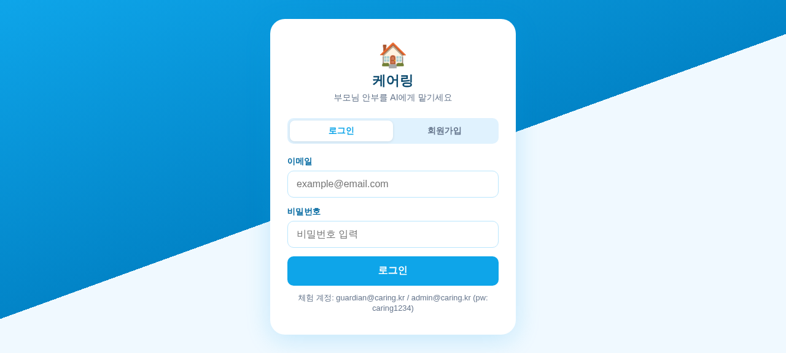

# 케어링 (Caring) — 부모님 안부를 AI에게

> 가족과 어르신을 잇는 스마트 케어 플랫폼 — 복약 알림, 안부 확인, 응급 SOS



---

## 화면 구성

| 화면 | 설명 |
|------|------|
| 로그인/회원가입 | 이메일 + 비밀번호, 역할(보호자/어르신) 선택 |
| 보호자 홈 | 연결된 부모님 현황, 복약 체크, 안부 메시지 |
| 어르신 홈 | SOS 긴급버튼, 복약 체크, 가족 안부 보내기 |
| 관리자 | 전체 사용자 현황, 서버 상태, 배포 체크리스트 |

### 체험 계정
- 보호자: `guardian@caring.kr` / `caring1234`  
- 어르신: `elder@caring.kr` / `caring1234`
- 관리자: `admin@caring.kr` / `caring1234`

---

## 기술 스택

- **백엔드**: Node.js + Express.js
- **DB**: PostgreSQL + Redis
- **인증**: JWT (Access 15분 / Refresh 30일)
- **IVR**: Twilio (선택)
- **프론트엔드**: Vanilla JS (SPA, 모바일 퍼스트)

---

## 빠른 시작

### 1. 의존성 설치

```bash
npm install
```

### 2. 환경변수 설정

```bash
cp .env.example .env
```

`.env` 파일을 열어 아래 값을 설정하세요:

```env
# 필수
SECRET_KEY=your_random_secret_32chars
REFRESH_SECRET_KEY=your_random_refresh_secret_32chars
DB_HOST=localhost
DB_PORT=5432
DB_NAME=caring_db
DB_USER=caring
DB_PASSWORD=your_db_password
REDIS_URL=redis://localhost:6379/0

# 선택 (Twilio IVR)
TWILIO_ACCOUNT_SID=
TWILIO_AUTH_TOKEN=
TWILIO_PHONE_NUMBER=
```

### 3. DB 초기화

```bash
# PostgreSQL에서 DB 및 유저 생성
psql -U postgres << EOF
CREATE USER caring WITH PASSWORD 'your_db_password';
CREATE DATABASE caring_db OWNER caring;
GRANT ALL PRIVILEGES ON DATABASE caring_db TO caring;
EOF

# 테이블 생성 (마이그레이션)
npm run db:migrate
```

### 4. 서버 실행

```bash
# 개발
npm run dev

# 프로덕션
npm start
```

서버가 **포트 8001**에서 실행됩니다.  
브라우저에서 `http://localhost:8001/app` 접속

---

## API 엔드포인트

| 메서드 | 경로 | 설명 |
|--------|------|------|
| POST | `/api/v1/auth/register` | 회원가입 |
| POST | `/api/v1/auth/login` | 로그인 |
| POST | `/api/v1/auth/logout` | 로그아웃 |
| POST | `/api/v1/auth/refresh` | 토큰 갱신 |
| GET | `/api/v1/users/me` | 내 정보 조회 |
| GET | `/api/v1/medications` | 복약 목록 |
| POST | `/api/v1/medications` | 복약 추가 |
| GET | `/health` | 헬스체크 |

---

## Docker로 실행

```bash
# docker-compose 사용
docker-compose up -d

# 또는 직접 빌드
docker build -t caring .
docker run -p 8001:8001 --env-file .env caring
```

---

## 추가로 구현 필요한 부분

### 🔴 필수 (서비스 출시 전)

1. **실시간 위치 추적**
   - DB: `location_logs` 테이블은 생성됨
   - 필요: 어르신 기기에 GPS SDK 연동, WebSocket 실시간 전송
   - 파일: `src/routes/location.js`

2. **보호자 네트워크 (초대 시스템)**
   - DB: `guardian_relationships` 테이블 생성됨
   - 필요: 이메일/SMS 초대 링크 발송 (SendGrid 또는 Twilio SMS)
   - 파일: `src/services/inviteService.js`

3. **건강 데이터 연동**
   - DB: `vitals` 테이블 생성됨
   - 필요: 혈압/혈당 기기 Bluetooth 연동 또는 수동 입력 UI

4. **Push 알림**
   - 필요: FCM 토큰 등록 및 복약 시간 알림 발송
   - 파일: `src/services/notificationService.js` (구현됨, FCM 키 필요)

5. **SMS/IVR 복약 알림**
   - TWILIO_ACCOUNT_SID, TWILIO_AUTH_TOKEN 설정 필요
   - 파일: `src/cron/medication_reminder.js`

### 🟡 권장 (사용자 경험 개선)

6. **소셜 로그인** (카카오/구글 OAuth)
7. **모바일 앱** (React Native 또는 PWA 전환)
8. **관리자 대시보드** 고도화 (Chart.js 등)
9. **다국어 지원** (현재 ko/ja/en i18n 구조 구현됨)

---

## 프로덕션 배포 체크리스트

```
[x] Express 서버
[x] JWT 인증
[x] bcrypt 비밀번호 해시
[x] Rate limiting
[x] CORS 설정
[x] PostgreSQL 연결
[x] Redis 연결
[ ] HTTPS/SSL 인증서
[ ] 도메인 설정
[ ] Twilio IVR
[ ] FCM Push 알림
[ ] 위치 추적
[ ] 이메일 발송 (SendGrid)
```

---

## 라이선스

Private — 노이반 프로젝트
